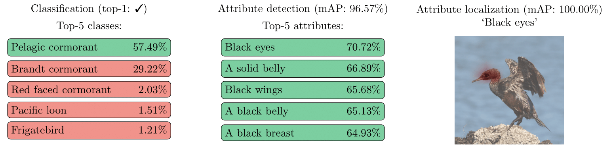

# Leveraging vision-language foundation models for fine-grained downstream tasks

This repository is the official implementation of the paper:
"Leveraging vision-language foundation models for fine-grained downstream tasks"



The paper is available [COMING SOON]()

## Getting Started

Configuration used for the paper:
- Python: 3.10.9
- Pytorch: 1.13.0
- CUDA: 11.7
- CUDNN: 8500

### Installation
```commandline
git clone https://github.com/FactoDeepLearning/MultitaskVLFM.git
cd MultitaskVLFM

# In your virtualenv, for instance:
conda create --name VLFM python=3.10
conda activate VLFM

pip install -e .
```


## Reproducing results
```commandline
python3 Multitasking/main.py --load-pretrain=True --train=False
```

## Training
```commandline
python3 Multitasking/main.py
```

Here is a list of the available arguments
```commandline
--output-name  # Name of the output folder [default="my_expe"]
--batch-size"  # Size of the training batch [default=2]
--num-epochs  # Number of training epochs [default=100]

--oracle  # Which oracle to use [default="OFA"] 
# Other option is "UIO", ignored if "--train-oracle-loc" is False

--model  # Which model to use as basis [default="open-ViT-L/14]
# Official CLIP: "ViT-B/32", "ViT-B/16", "ViT-L/14", "ViT-L/14@336px"
# CLIP trained on LAION: "open-ViT-L/14", "open-ViT-H-14", "open-ViT-G-14"

--image-encoder  # Which image encoder to use [default="swin_vision"]
# None to preserve clip image encoder or "swin_vision"

--load-pretrain  # Whether to load pre-trained weights or not [default=False]
# Must be used with default values for --train-X options

--train  # Wheter to train the model until reaching "--num-epochs" or not [default=True]
--eval  # Whether to evaluate the model on the test set or not [default=True]

--train-class  # Whether to use classification loss (through embedding similarity) or not [default=True]
--train-attr  # Whether to use attribute detection loss (through embedding similarity) or not [default=True]
--train-loc  # Whether to use attribute localization loss (with expert annotation as ground truth) or not [default=True]
--train-oracle-loc  # Whether to use attribute localization loss (with oracle annotation as ground truth) or not [default=False]
--train-proj-class"  # Whether to use classification loss (through projection) or not [default=True]
--train-proj-attr  # Whether to use attribute detection loss (through projection) or not [default=False]

# Weights for the different losses
--weight-class [default=1]
--weight-attr [default=1]
--weight-loc [default=1]
--weight-oracle-loc [default=1]
--weight-proj-attr [default=1]
--weight-proj-class [default=1]

--adapter-image  # Whether to only train image encoder last layers or not [default=False]
--adapter-text  # Whether to only train text encoder last layers or not [default=True]
--neg-attributes  # Whether to use the positive/negative prompt formulation or not [default=True]
```

## Citation

COMING SOON